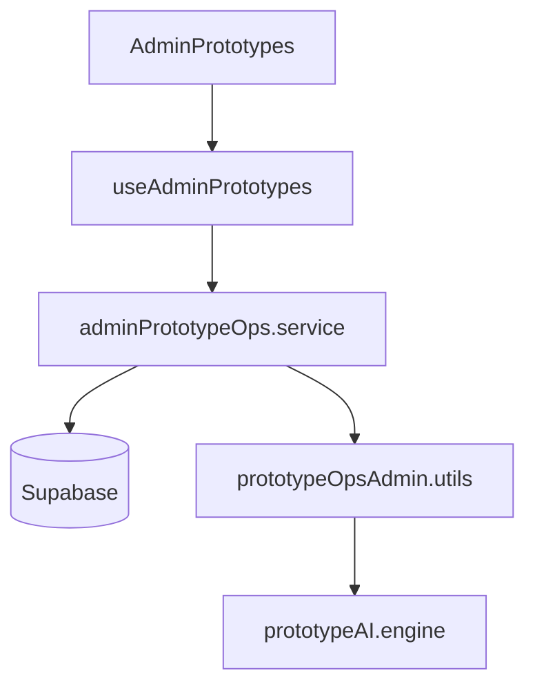

# Prototype Operations Center — Architecture & Enterprise Readiness

See `src/modules/admin/prototypes/` for implementation. Apply migration `supabase/migrations/20260617000002_prototype_ops_admin.sql` for governance tables and admin RPC.

## Architecture

## Enterprise Readiness

| Capability | Status |
|------------|--------|
| Executive KPIs (10) | ✅ |
| 11-stage lifecycle | ✅ |
| Enterprise registry | ✅ |
| Digital twin | ✅ |
| Maya AI | ✅ |
| RBAC | ✅ manage_projects |
| Real DB data | ✅ No mocks |
